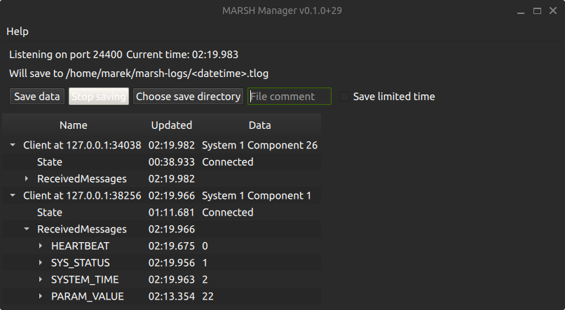

# MARSH Manager

The `marsh-mgr` program is a graphical application for Linux and Windows that serves as the central node in the simulator architecture.

It is meant as a single tool to provide:

- Communicating data between simulator parts (nodes)
- Controlling the simulation execution and configuration
- Logging and replaying the simulation data

## Usage

Start the application executable, either `marsh-mgr` or `marsh-mgr.exe`.
If other nodes are running on different computers, configure "manager address" to IP address of the computer running the manager.

### Saving data

The user can choose a folder to save the data, the files are named depending on the logging start time to avoid overwriting previous saves.
A "file comment" can be added which will be a part of the generated filename, but will also be saved as a [STATUSTEXT](../mavlink/common.md#STATUSTEXT) message at the start of the file.
The maximum length for file comment is 50 characters.

!!! tip
    You can use the file comment to help with your data processing afterwards: write test subject initials, short description of test case etc.

The data files saved are "MAVLink telemetry log", recognizable by `.tlog` extension.
This binary file format is a de facto standard between multiple UAV flight stacks, the file just contains MAVLink messages, each preceded by a timestamp in microseconds.

There are multiple external tools available for viewing the logs, notable examples:

- [MAVLink Support](https://it.mathworks.com/help/uav/mavlink-support.html?s_tid=CRUX_lftnav) in MATLAB's UAV Toolbox includes [`mavlinktlog` function](https://it.mathworks.com/help/uav/ref/mavlinktlog.html)
- [pymavlink library](https://github.com/ArduPilot/pymavlink) which is used for generating libraries and communication for Python also has [`mavlogdump.py` script](https://github.com/ArduPilot/pymavlink/blob/master/tools/mavlogdump.py)
- Some online tools like [UAV Log Viewer](https://plot.ardupilot.org/) can read `.tlog` files.
- ArduPilot's [MAVExplorer](https://ardupilot.org/dev/docs/using-mavexplorer-for-log-analysis.html) can be used for plots, filtering data and showing it on a map

## Roadmap

The following are already planned future features of MARSH Manager, approximately in the order of priority / expected implementation date:

- Support for [Parameter Protocol](https://mavlink.io/en/services/parameter.html):
    - Requesting parameters from nodes on connecting and on start of saving data
    - Showing parameters in Network View with a possibility to edit the values
    - *Maybe later:* parameter descriptions with [Component Metadata Protocol](https://mavlink.io/en/services/component_information.html)
    - *Maybe later:* setting parameters of multiple components based on test matrix
- Using full message definitions:
    - Displaying units of message fields
        - Displaying angular values sent as radians also as degrees
    - Showing text identifiers for enum values
        - Find length of common prefix from enum names
        - Show bitfields as a collection of flags
    - *Maybe later:* using Qt "What's This" role with tooltips to show descriptions for message fields and enum constants
- Replaying log files

## Licenses

The code for MARSH Manager is licensed under [GNU General Public License v3.0](https://github.com/marsh-sim/marsh-manager/blob/main/LICENSE.txt)

General application structure provided by [Qt Framework](https://www.qt.io/product) under terms of the [GNU Lesser General Public License (LGPL)](https://doc.qt.io/qt-6/lgpl.html)

Communication between components with [MAVLink](https://mavlink.io/en/) using generated code under [MIT License](https://github.com/mavlink/mavlink/blob/master/COPYING)
