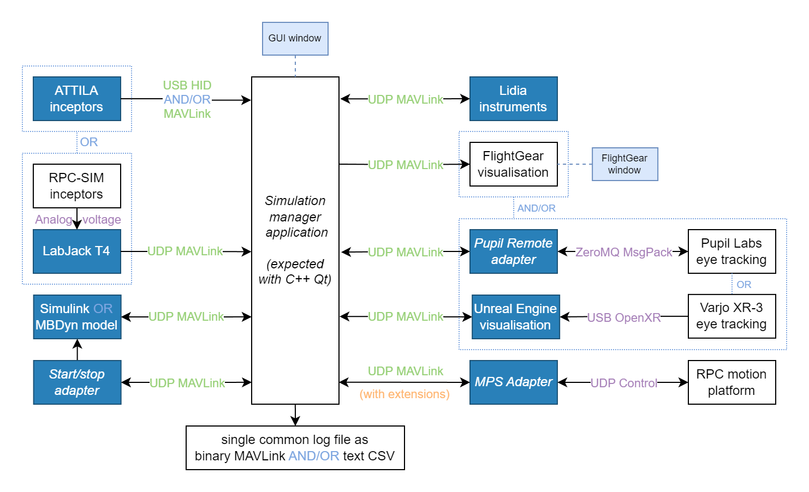

# Simulator nodes

The purpose of nodes is to maintain the [separation of concerns](https://en.wikipedia.org/wiki/Separation_of_concerns) principle.
In short, if each node has a single responsibility, it is easier to reuse them in new ways and avoid repeating work (see&nbsp;[rationale](../rationale.md)).

