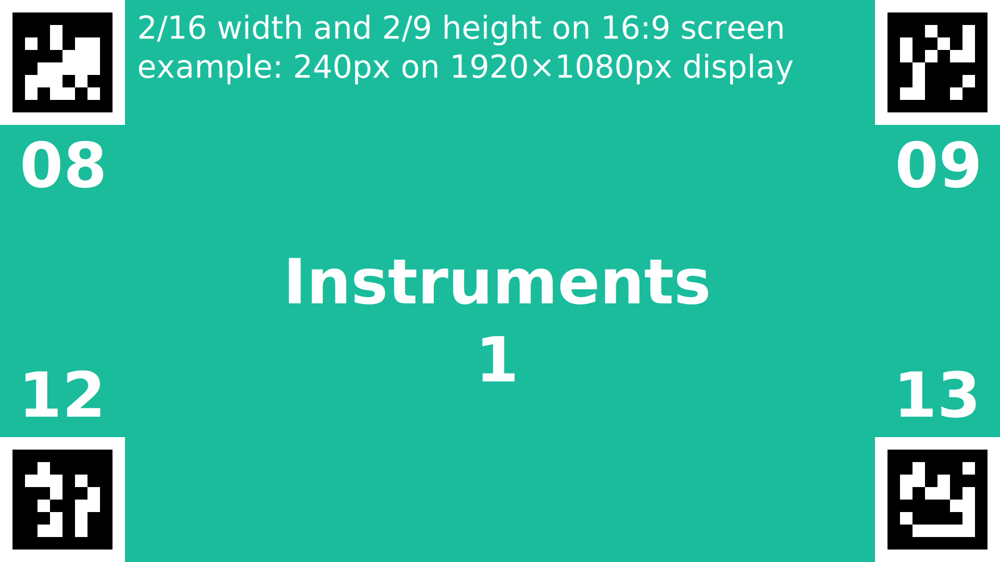
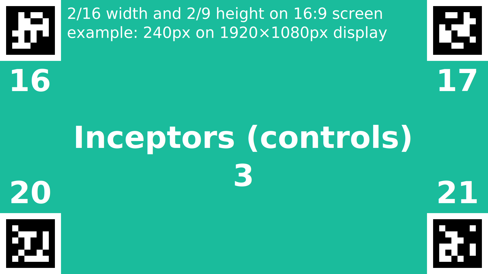
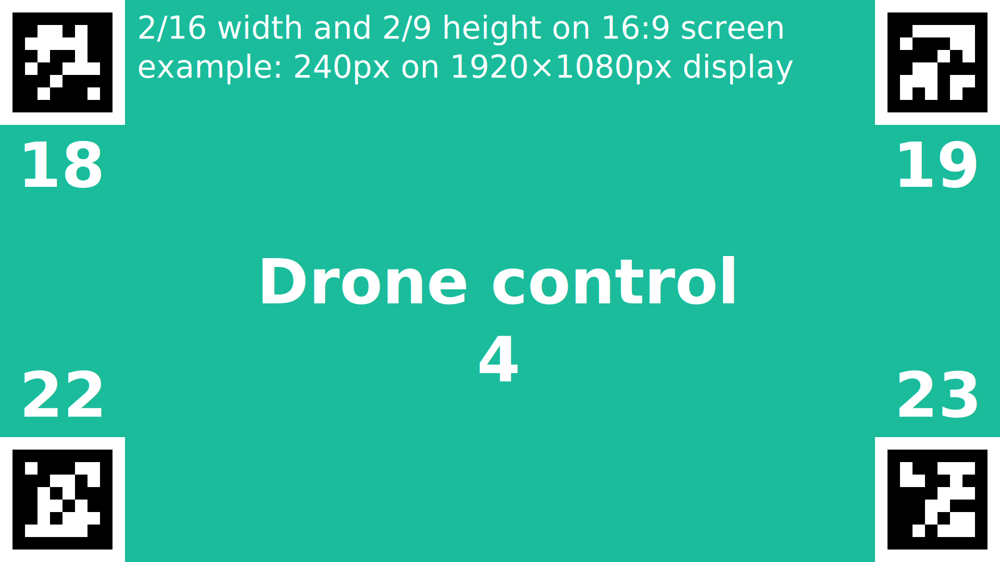

# Eye tracking

This article describes setup for eye tracking experiments using a wearable eye tracker (not VR helmet).

## Prerequisites

- Eye tracking device, we're using [Pupil Labs Core](https://pupil-labs.com/products/core)
- [Pupil Capture](https://github.com/pupil-labs/pupil) software on a computer with USB-C port to which the device will be connected
- [PureRef](https://www.pureref.com/) art reference program for showing marker overlay **on every computer showing a pilot screen**
- Download `.pur` files from [eye_tracking folder in `sim-nodes` repo](https://github.com/marsh-sim/sim-nodes/tree/main/eye_tracking) on computers with PureRef

## Usage

The PureRef scenes are prepared using [AprilTags tag36h11 markers](https://github.com/AprilRobotics/apriltag-imgs/tree/master/tag36h11) in every corner of the display.

Steps to use a scene on a given display.
The PureRef menu is opened by right clicking in the window, or any of the images when shown as overlay.

1. Open the `.pur` file
1. With no selection, click "Mode > Overlay Selection" and accept
1. Select **all four** images, can be done with `Ctrl+A` if some of them are off screen, drag and scale to fit the corners of the display
1. Check "Mode > Always On Top"
1. Check "Canvas > Lock Canvas"
1. Check "Mode > Transparent To Mouse" and accept

If you need to change anything after this point, you need to focus the PureRef window in a different way than clicking on it, for example from the taskbar.

## Defined screens

The following are provided as reference for what is in `.pur` files found in the repository, and to propose some consistent values for `surface_id` field of [EYE_TRACKING_DATA](../mavlink/marsh.md#EYE_TRACKING_DATA) message.

### Instruments

Surface id **1**, example: page `pfd` of [lidia](./README.md#lidia-instruments).

### Outside view

Surface id **2** with a view outside the aircraft, or just the screen with visualisation

### Inceptors

Surface id **3** showing control positions, example: page `controls` of [lidia](./README.md#lidia-instruments).

### Drone control

Surface id **4** for controlling cooperating Unmanned Aerial Vehicles (UAVs), example: an instance of [QGroundControl](http://qgroundcontrol.com/)

